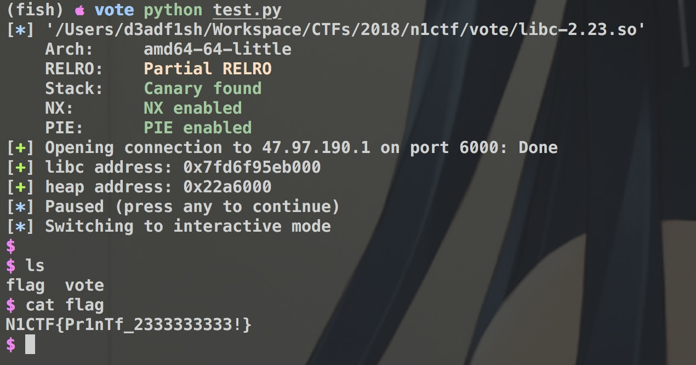

## vuln

很容易看出来`UAF`，刚开始想到可以用堆合并，然后改`size`加`fastbin attack`，但是在控制`rip`之后不能用`one shot`。(`unpwn1.py1)

## exp

`exp.py`。类似`house of orange`。首先还是用堆合并，改size，不过是扩大`size`，方便之后修改`size`为0x61。

### 0x01

首先最开始让堆布局如下
```
----------
chunk0 size: 0x101
----------
chunk1 size: 0x31
----------
chunk2 size: 0x101
----------
chunk3 size: 0x101
----------
chunk4 size: 0x101
----------
chunk5 size: 0x221
----------
```

然后释放`chunk0`和`chunk2`，利用`show`泄漏出`main_arena`(算出`libc`)和`heap`地址。

### 0x02

释放`chunk3`，这样的话`chunk2`和`chunk3`就会合并，我们在申请这个合并块的大小。

```Python
fake_chunk = '6'*0xE0
fake_chunk += p64(0) + p64(0x2A1)   # change size bigger
fake_chunk += p64(0xFFFFFFFFFFFFFFFF) + p64(0x555555)
fake_chunk += '\n'
create(0x1E8, fake_chunk)   # 6
```
新建的块称`chunk6`，这样的话改`chunk3`的`size`为`0x2A1`，这样就可以覆盖`chunk4`很大一块了。然后把`chunk4`用来进行`unsorted bin attack`。

最核心的其实就是`chunk3`要大到之后能对`chunk4`修改，并且修改之后`chunk4`要是在`unsorted bin`里面，这样再`malloc`，就能触发`house of orange`了。

### 0x03

改好`_IO_list_all`之后，再`malloc`触发异常即可`getshell`

### 0x04


看这个`flag`总赶紧好像预期解法不是这样。。

